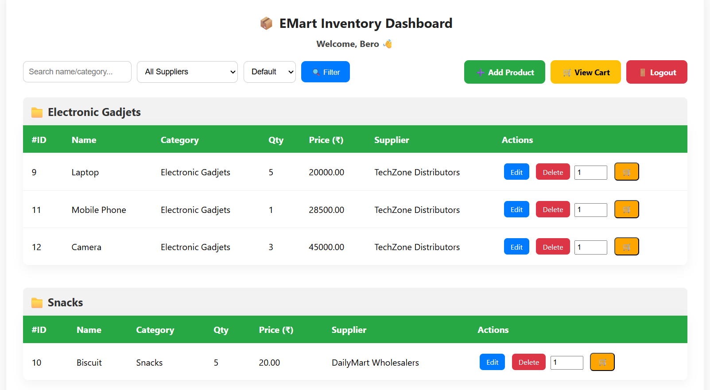
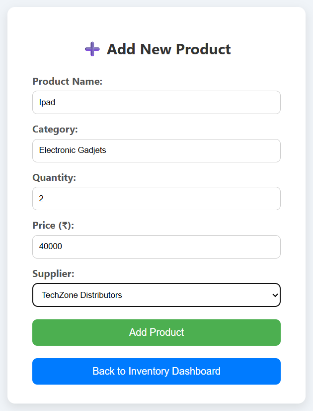

# 🛒 EMart Inventory Management System

EMart Inventory Management System is a web-based application developed using **PHP and MySQL** to manage product inventory, track stock, and handle basic cart and order operations efficiently.

This project is designed for academic purposes and demonstrates CRUD operations, database connectivity, and session-based authentication.

---

## 📌 Features

- Admin login authentication  
- Add, edit, and delete products  
- View available inventory  
- Add products to cart  
- Place orders  
- MySQL database integration  
- Simple and user-friendly interface  

---

## 🛠️ Technologies Used

- **Frontend:** HTML, CSS, JavaScript  
- **Backend:** PHP  
- **Database:** MySQL  
- **Server:** XAMPP (Apache & MySQL)  
- **Version Control:** Git & GitHub  

---

## 🗄️ Database Details

- **Database Name:** `emart_db`
- Tables include:
  - `users` / `admin`
  - `products`
  - `cart`
  - `orders`

---

## ⚙️ How to Run the Project Locally

1. Install **XAMPP**
2. Start **Apache** and **MySQL**
3. Clone this repository:
   ```bash
   git clone https://github.com/Berosin/emart-inventory-management.git
4.Move the project folder to:
         C:\xampp\htdocs\
5.Open phpMyAdmin
6.Create a database named:
          emart_db
7.Import the database SQL file (if available)
8.Open the browser and run:
    http://localhost/emart_inventory/login.php

## 📸 Screenshots

### 🔑 Login Page


### 📊 Inventory Dashboard


### ➕ Add Product Page


### 🛒 Cart Page

